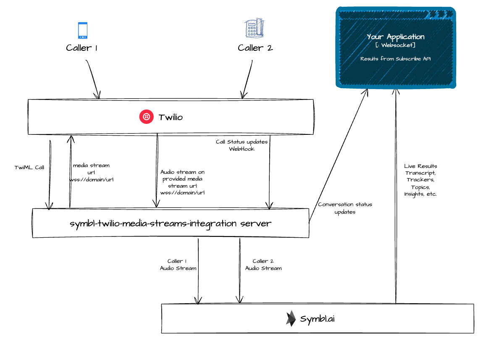
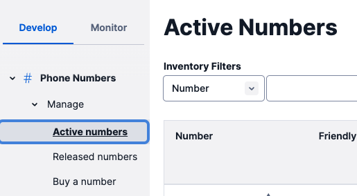
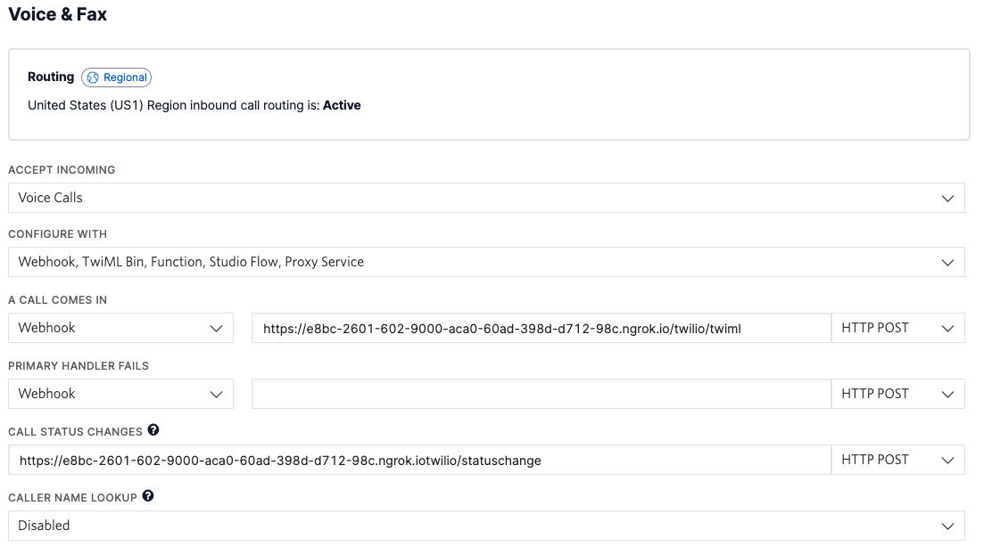

# Streaming Integration with Twilio Voice using Twilio Media Streams

If you are using or planning to use [Twilio Programmable Voice](https://www.twilio.com/docs/voice) offering, 
this sample implementation shows how to integrate Symbl in real-time using Streaming API, and also use Subscribe API
to subscribe to live results.

This is a sample implementation of a "bridge" server between Twilio and Symbl.ai. We will refer to it as "bridge server"
or "symbl-twilio-media-streams-integration server" in this document.


## How it works?

1. As two callers call a same Twilio number, that you have configured your Twilio account and being used in your application,
Twilio makes call to our bridge server for further instructions. Bridge server responds with connecting them, and sends a
websocket url where it will expect the audio data to be pushed by Twilio in real-time as both callers are talking.

2. Bridge server also creates two separate connections with Symbl using Streaming API for each individual caller. These
connections are already created with the Symbl request configuration for audio encoding, trackers, insights, topics, etcetera
   parameters. Twilio sends audio data encoded in MuLaw at 8,000 Hz sample rate, which needs to be used when starting
   Symbl connections.
   
3. As Twilio starts sending audio data on the provided websocket url, the bridge server converts it from base64 encoded
audio sent by Twilio into plain binary format as understood by Symbl Streaming API.
   
4. If you want to use the live results in your application, you can subscribe to conversation status updates form
the bridge server. And subscribe to all the Symbl results by simply using Symbl Subscribe API.



## Pre-requisite

Make sure you have active Twilio and Symbl.ai accounts. If you don't have them already please create them first.
Sign up for Twilio - https://www.twilio.com/try-twilio
Sign up for Symbl.ai - https://platform.symbl.ai/#/signup

You will need NodeJS 12+ installed for setting up this server.

## Setup

### Update configuration in .env
Make a copy of `.env.example` file with name `.env`. This file will contain the required configurations of Twilio
and Symbl for our bridge server to use.

```shell
cd symbl-twilio-media-streams-integration
cp .env.example .env
```

Your `.env` file has these configurations -
#### Twilio related configuration
* `TWILIO_ACCOUNT_SID`
* `TWILIO_AUTH_TOKEN`
* `TWILIO_NUMBER`

On your home page of Twilio, you can find the Account SID and Auth Token. Update those in `TWILIO_ACCOUNT_SID` and
`TWILIO_AUTH_TOKEN` respectively.


If you already have an active Twilio phone number that you want to use, please update that in `TWILIO_NUMBER`. If you don't
have one, you'll need to buy a new number.



#### Symbl related configuration
* `SYMBL_APP_ID`
* `SYMBL_APP_SECRET`
* `SYMBL_API_BASE_URL` default - https://api.symbl.ai

On your home page of Symbl, you can find the App id and App secret. Update those in `SYMBL_APP_ID` and `SYMBL_APP_SECRET`.

If you are not using Symbl private tenant, you don't need to change the default API base URL.

#### Server configuration
* `MODE` - default `conference`. Keep this to `conference` if you want to support two party (agent, customer) calls.
* `WEBHOOK_DOMAIN` - Update this with the domain where you'll be hosting/exposing this server.
* `AGENT_PHONE` - Phone number of your agent where the call will connect for Agent
* `CUSTOMER_PHONE` - Phone number of the customer where the call will connect for Customer

If you don't want to host a full-fledged server for initial testing, you can use `ngrok` to create a temporary public proxy
for your local server.

Install `ngrok` on your machine from here - https://ngrok.com/download

Then run `ngrok` command to create public server proxy.
```shell
ngrok http 127.0.0.1:3000
```

This should create a ngrok proxy on your machine, and will print out the public forwarding URL.


Copy the domain part of the URL from one of the `Forwarding` field in the output.

For example, in above output the expected domain part of URL we need would be `e8bc-2601-602-9000-aca0-60ad-398d-d712-98c.ngrok.io`.

Update this domain in the `WEBHOOK_DOMAIN` field in the `.env` file.

### Configure Twilio

Next, you need to update Twilio to use the correct URLs to talk to our bridge server.

Go to the "[Develop -> Phone Numbers -> Active Numbers](https://console.twilio.com/us1/develop/phone-numbers/manage/incoming)" page in Twilio.
Click on the phone number you have configured in `TWILIO_NUMBER` field in `.env` file.
Under "Voice & Fax" section on the page, update following fields -
* `A CALL COMES IN` -
   * Type: `Webhook`
   * URL: `https://<WEBHOOK_DOMAIN>/twilio/twiml`
   * HTTP Method: `HTTP POST`
* `CALL STATUS CHANGES` -
   * URL: `https://<WEBHOOK_DOMAIN>/twilio/statuschange`
   * HTTP Method: `HTTP POST`

Your configuration should look like this -


Save the configuration after the updates.

At this point your set up should be ready!

### Start the server

Make sure your node version is 12+.
```shell
node -v
```

Start the server.
```shell
npm start
```

Your server should start on port 3000.

## Usage

### Start call processing
Use the two phone numbers configured in `AGENT_PHONE` and `CUSTOMER_PHONE` to call the `TWILIO_NUMBER` simultaneously.
You should be able to see in the server logs that the audio stream from both callers is getting processed by Symbl and the
results Symbl is returning.

### Subscribing to the results
You can subscribe to the active connection using the connection ID.

We'll use Postman for this example to show how to subscribe to the live connection. You can use the similar approach
in your application logic. Make sure you have [Postman installed](https://www.postman.com/) on your machine.

Our bridge server has a websocket endpoint that updates Symbl conversation lifecycle status. We'll use that to receive
connection id of the active call being used with Symbl. Then we'll use that connection id to subscribe with Symbl's Subscribe API
endpoint.

Before starting the call processing, connect to `/symbl/updates` websocket endpoint of our bridge server.
1. [Create new WebSocket request](https://learning.postman.com/docs/sending-requests/websocket/websocket/#creating-websocket-requests) in Postman.
2. Enter the URL as `wss://WEBHOOK_DOMAIN//symbl/updates`. For example - `wss://e8bc-2601-602-9000-aca0-60ad-398d-d712-98c.ngrok.io//symbl/updates`.
3. Click "Connect".

Now let's keep our Subscribe API endpoint also ready in Postman.
1. [Generate the access token](https://docs.symbl.ai/docs/authenticate#generate-an-access-token) using Symbl credentials (app id and app secret).
2. [Create another new WebSocket request](https://learning.postman.com/docs/sending-requests/websocket/websocket/#creating-websocket-requests) in Postman.
3. Enter the URL as `wss://api.symbl.ai/subscribe/<connectionId>?access_token=ACCESS_TOKEN`. Here, replace `ACCESS_TOKEN`
with the access token you received from step #1. We will replace `<connectionId>` with the connection id we receive in `/symbl/updates`
   endpoint from our other websocket connection with bridge server.
   
Start the call again by dialing from both phone numbers. You should receive a JSON message on `/symbl/updates` connection 
in postman. Copy the value from `connectionId` field, and replace it in the other Subscribe API for `<connectionId>` 
in the URL, and click "Connect".

You will start receiving the results of the on-going call from Symbl.

